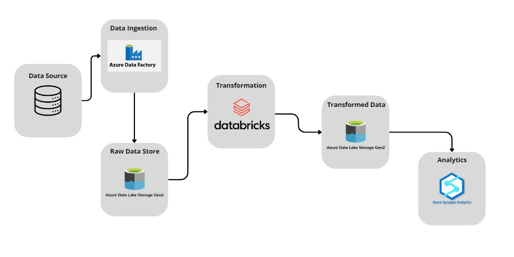
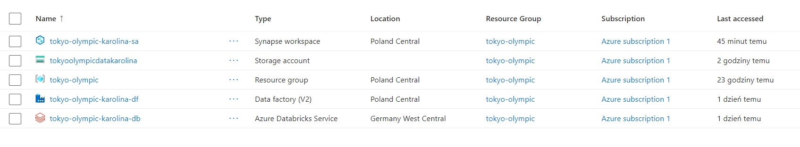
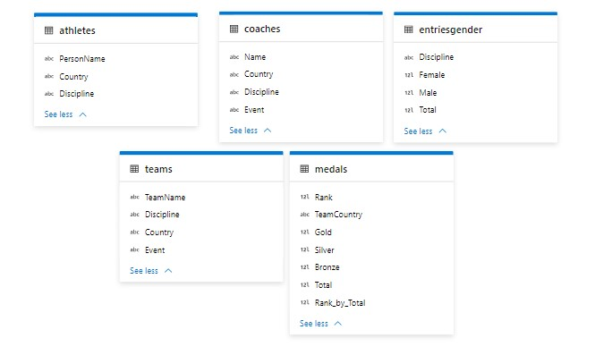

# Tokyo Olympic Data ETL
## Introduction
 This project focuses on building a comprehensive data pipeline for the Tokyo Olympic Games. It utilizes Azure services such as Data Lake Gen2 for data storage, Data Factory for integration, Databricks for transformation, and Synapse Analytics for analysis. The goal is to efficiently manage data, process it, and generate valuable insights to support the Olympic events.
## Technologies Used
1. Programming Language - Python
2. Scripting Language - SQL
3. Azure Cloude Platform:
  - **Azure Data Lake Gen2**: Storage for raw and processed data.
  - **Azure Data Factory**: Orchestration and automation of data workflows.
  - **Azure Databricks**: Advanced analytics and data transformation.
  - **Azure Synapse Analytics**: Data warehousing and analytics

## Project Structure

## Setup Instructions
1. Azure Account: Ensure you have an active Azure account.
2. Azure Resources: Create necessary Azure resources - Data Lake Gen2, Data Factory, Databricks, and Synapse Analytics.
3. Configuration: Update configuration files with your Azure credentials and project-specific details.
4. Run Pipelines: Execute Data Factory pipelines for ETL, monitor Databricks jobs, and utilize Synapse Analytics for analytics.

## Dataset Used
Orginal Data Source  - https://www.kaggle.com/datasets/arjunprasadsarkhel/2021-olympics-in-tokyo

Here is dataset used in this projects - https://github.com/KWas866/tokyo-olympic-data-ETL/tree/master/data

## Data Model

## Scripts for projects
- [Transformations Scripts in Python]( tokyo_olympic_transformatiom.ipynb)
- [SQL Scripts from Synapse Analytics](SQLScripts.sql)
  - [Charts for SQL Scripts from Synapse Analytics](SQLCharts)
